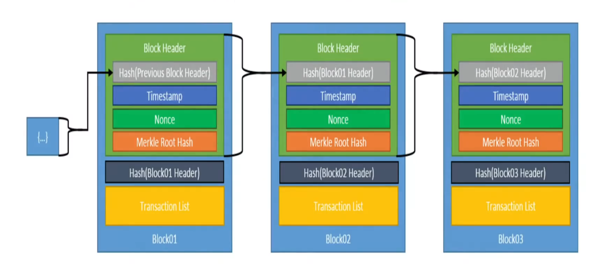

# Blockchain-mini-project

#  starting pool of money exists
- each transaction is recorded, and signed by the sender. [256 bit]
- each transaction is id'd, so that every transaction goes up in id [id 0, id 1, id 2]
- each signature changes per id, so that no two of the same signature exists, preventing foraging. 
- 
# Transactions 
# Transactions will have:
Transaction
- inputs
- outputs
- timestanp

TransactionInput: 
- output token id
- output index 

Transaction Output:
- index
-  value
- recipeint

# Nodes represent each device/User. They have:
- mempool: stores all transactions waiting to be broadcast.
- blockchain
- validation checks for transaction forwarding

Structure for an individual Block:

